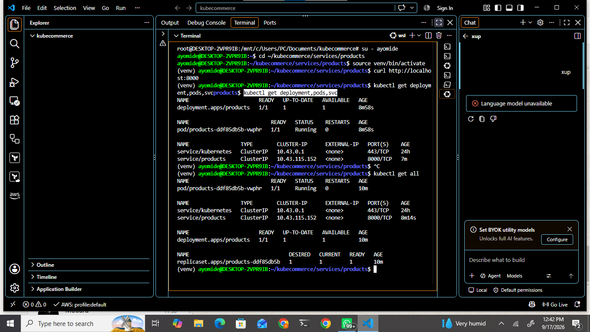
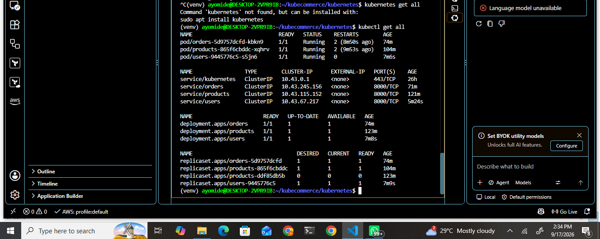
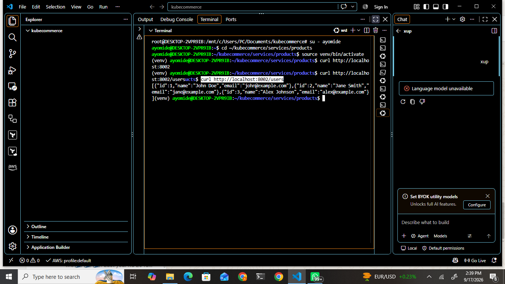
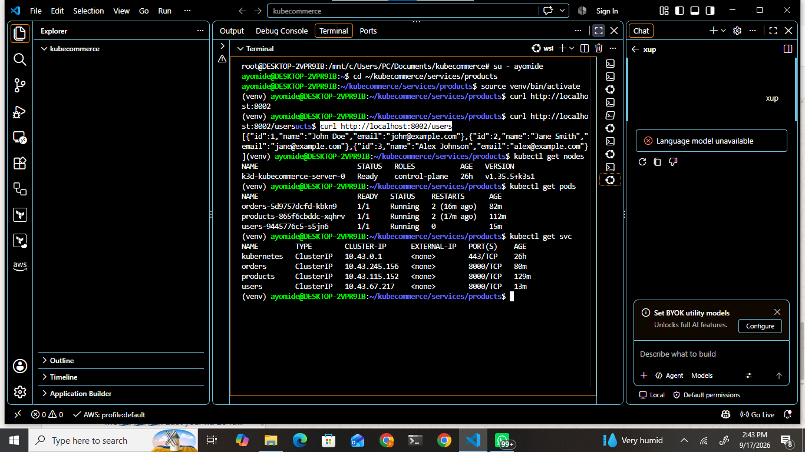
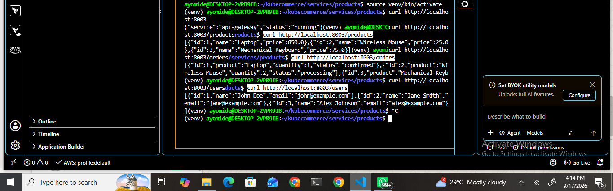
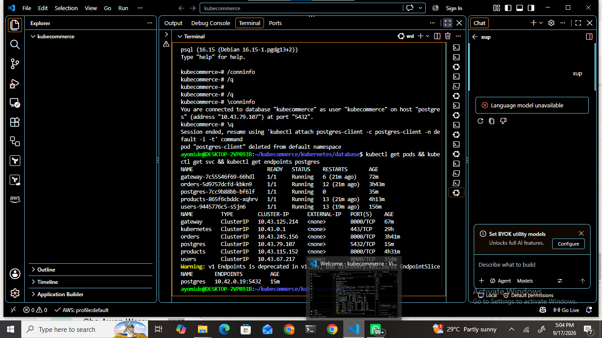
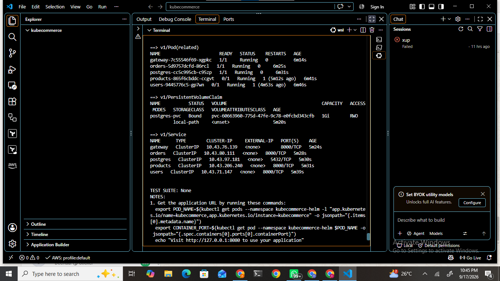
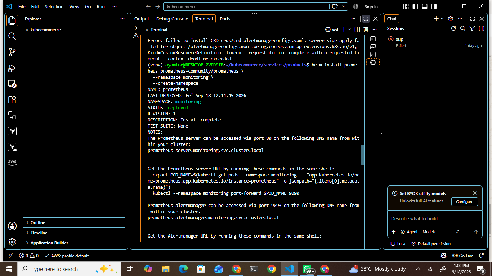

# KubeCommerce

**A production-style Kubernetes microservices platform** demonstrating modern DevOps practices: containerization, Kubernetes orchestration, networking, persistent storage, Helm, monitoring, CI/CD, and Infrastructure as Code.


---

## Project Overview

KubeCommerce is a containerized e-commerce backend composed of multiple independent microservices running on Kubernetes.

The project demonstrates how a modern cloud-native application can be developed, containerized, deployed, monitored, validated, and managed using real DevOps practices.

### Main Technologies

| Category              | Tools                                      |
|-----------------------|--------------------------------------------|
| Orchestration         | Kubernetes, K3s, k3d                       |
| Containerization      | Docker                                     |
| Language & Framework  | Python, FastAPI                            |
| Database              | PostgreSQL                                 |
| Ingress               | Traefik                                    |
| Packaging             | Helm                                       |
| Monitoring            | Prometheus, Grafana                        |
| Infrastructure as Code| Terraform                                  |
| CI/CD                 | GitHub Actions, Kubeconform                |
| Environment           | Linux / WSL                                |

---

## Architecture

The application follows a classic microservices architecture.

**Request flow:**

```
Client → Traefik Ingress → API Gateway → Microservices → PostgreSQL
```

The API Gateway communicates with the individual backend services using Kubernetes service discovery.

### Core Services

| Service      | Purpose                  | Port  |
|--------------|--------------------------|-------|
| Gateway      | Main API entry point     | 8000  |
| Products     | Product management       | 8000  |
| Orders       | Order management         | 8000  |
| Users        | User management          | 8000  |
| PostgreSQL   | Persistent database      | 5432  |
| Traefik      | Kubernetes ingress       | 80/443|

---

## Microservices

### Products Service

Provides product-related API endpoints.

**Endpoints**

- `GET /`
- `GET /health`
- `GET /products`

Example product data includes Laptop, Wireless Mouse, and Mechanical Keyboard.

The service is containerized with Docker and deployed to Kubernetes as a Deployment + ClusterIP Service.

### Orders Service

Manages sample customer orders.

**Endpoints**

- `GET /`
- `GET /health`
- `GET /orders`

### Users Service

Provides user-related API functionality.

**Endpoints**

- `GET /`
- `GET /health`
- `GET /users`

### API Gateway

Single entry point for the backend services. Clients talk only to the Gateway; the Gateway talks to the microservices using Kubernetes DNS.

**Internal communication targets**

- `products:8000`
- `orders:8000`
- `users:8000`

**Gateway Endpoints**

- `GET /`
- `GET /health`
- `GET /products`
- `GET /orders`
- `GET /users`

This demonstrates internal Kubernetes service discovery and inter-service communication.

---

## Docker

Each application service is containerized independently.

**Images created**

- `kubecommerce-products:1.0`
- `kubecommerce-orders:1.0`
- `kubecommerce-users:1.0`
- `kubecommerce-gateway:1.0`

Docker provides consistent runtime environments and allows each service to be built and deployed independently.

---

## Kubernetes

The application runs on a local Kubernetes cluster created with **k3d** (K3s distribution).

| Item        | Value          |
|-------------|----------------|
| Cluster     | `kubecommerce` |
| Distribution| K3s            |
| Runtime     | Docker         |
| Tool        | k3d            |

**Kubernetes resources used**

- Deployments
- Services (ClusterIP)
- ConfigMaps
- PersistentVolumeClaims
- Ingress
- Namespaces
- Pods

Kubernetes provides orchestration, service discovery, health checking, scaling, and workload management.

### Deployments

Each microservice runs as a Kubernetes Deployment. Deployments manage the desired number of Pods and keep the workload in the declared state. Health probes (`/health`) are configured where appropriate.

### Services

ClusterIP Services provide stable internal networking:

- `products:8000`
- `orders:8000`
- `users:8000`
- `gateway:8000`
- `postgres:5432`

Applications communicate using Kubernetes DNS names instead of Pod IP addresses.

---

## PostgreSQL & Persistent Storage

KubeCommerce uses PostgreSQL as its relational database.

| Setting          | Value              |
|------------------|--------------------|
| Database         | `kubecommerce`     |
| User             | `kubecommerce`     |
| Service          | `postgres:5432`    |

### Persistent Volume

A PersistentVolumeClaim is used for PostgreSQL data:

| Attribute       | Value          |
|-----------------|----------------|
| Name            | `postgres-pvc` |
| Storage Class   | `local-path`   |
| Access Mode     | `ReadWriteOnce`|
| Requested Size  | `1Gi`          |
| Mount Path      | `/var/lib/postgresql/data` |

This demonstrates proper use of Kubernetes persistent storage instead of ephemeral container storage.

---

## Ingress (Traefik)

Traefik is used as the Kubernetes ingress controller.

**Request path**

```
Client
  ↓
Traefik
  ↓
API Gateway
  ↓
Products / Orders / Users
  ↓
PostgreSQL
```

External requests enter through the Ingress and are routed to the API Gateway.

---

## Helm

A Helm chart was created for KubeCommerce.

**Location**

```
helm/kubecommerce
```

The chart contains Kubernetes templates for the major application components.

**Benefits demonstrated**

- Kubernetes package management
- Reusable templates
- Configuration management
- Repeatable deployments
- Easier application installation

The chart was successfully linted and rendered.

---

## Monitoring

Monitoring infrastructure was added using:

- **Prometheus** – metrics collection
- **Grafana** – visualization and dashboards

Monitoring components were installed into a dedicated namespace:

```
monitoring
```

This demonstrates how Kubernetes workloads can be observed with standard cloud-native monitoring tools.

---

## CI/CD (GitHub Actions)

GitHub Actions was configured for automated project validation.

**Pipeline flow**

```
Git Push
  ↓
GitHub Actions
  ↓
Install Dependencies
  ↓
Build Docker Images (products, orders, users, gateway)
  ↓
Validate Kubernetes Manifests (Kubeconform)
  ↓
Success
```

The workflow successfully completed with green runs.

> **Note**  
> The current workflow performs CI (build + manifest validation).  
> It does **not** automatically deploy to a remote Kubernetes cluster.

---

## Terraform / Infrastructure as Code

Terraform was integrated into KubeCommerce to demonstrate Infrastructure as Code for the Kubernetes environment.

**Terraform files**

```
terraform/
├── main.tf
├── providers.tf
├── variables.tf
└── outputs.tf
```

**Resources defined**

- Kubernetes namespace
- API Gateway Deployment
- API Gateway Service
- Configurable replica count
- Terraform outputs

**What was successfully completed**

| Command              | Result |
|----------------------|--------|
| `terraform init`     | ✅     |
| `terraform fmt`      | ✅     |
| `terraform validate` | ✅     |

Terraform also successfully connected to the local Kubernetes environment during earlier stages of the implementation.

### Terraform Apply Limitation

The final provisioning step (`terraform apply`) was **not completed** because the local Kubernetes API server began returning TLS handshake timeouts:

```
net/http: TLS handshake timeout
```

The same connectivity issue affected `kubectl`, confirming that the problem was with the local Kubernetes API environment rather than the Terraform configuration itself.

The Terraform configuration therefore remains in the repository as a functional Infrastructure-as-Code implementation. It can be applied when the Kubernetes API environment is healthy.

> We deliberately chose **not** to destroy and recreate the working cluster just to force a successful `terraform apply`. This is a realistic DevOps decision.

---

## Project Structure

```
kubecommerce/
│
├── apps/
├── docs/
│   └── screenshots/
├── helm/
│   └── kubecommerce/
├── kubernetes/
│   ├── deployments/
│   ├── services/
│   ├── ingress/
│   └── storage/
├── monitoring/
├── services/
│   ├── products/
│   ├── orders/
│   ├── users/
│   └── gateway/
├── terraform/
│   ├── main.tf
│   ├── providers.tf
│   ├── variables.tf
│   └── outputs.tf
├── .github/
│   └── workflows/
│       └── ci.yml
└── README.md
```

---

## Screenshots

### 01 — Kubernetes Product Service


### 02 — Kubernetes Users Service


### 03 — All Microservices Running


### 04 — Users Kubernetes API Test


### 05 — Kubernetes Cluster Overview


### 06 — API Gateway Microservices Routing


### 07 — PostgreSQL Database Healthy


### 09 — Helm Release Deployment


### 10 — Monitoring


### 11 — GitHub Actions CI Success


### 12 — GitHub Actions CI/CD Success


---

## DevOps Concepts Demonstrated

| Concept                  | Implementation                                      |
|--------------------------|-----------------------------------------------------|
| Containerization         | Docker images for each microservice                 |
| Microservices            | Products, Orders, Users, Gateway                    |
| Kubernetes Orchestration | Deployments, Services, Pods, Namespaces             |
| Service Discovery        | Kubernetes DNS (`products:8000`, etc.)              |
| Persistent Storage       | PostgreSQL + PVC (`local-path`, 1Gi)                |
| Ingress                  | Traefik                                             |
| Helm                     | Chart packaging and templating                      |
| Monitoring               | Prometheus + Grafana in dedicated namespace          |
| CI/CD                    | GitHub Actions + Kubeconform validation             |
| Infrastructure as Code   | Terraform (init / fmt / validate completed)         |

---

## Testing

### Application Level
FastAPI endpoints were tested with HTTP requests, for example:

```bash
curl http://localhost:8001/orders
```

Health endpoints (`/health`) were also verified.

### Kubernetes Level
```bash
kubectl get pods
kubectl get deployments
kubectl get services
kubectl get ingress
kubectl get pvc
```

### Ingress Level
Routes tested through Traefik:

- `/`
- `/products`
- `/orders`
- `/users`

### CI Level
GitHub Actions successfully validated all Kubernetes manifests with Kubeconform.

---

## Lessons Learned

1. Kubernetes resources should be defined declaratively.
2. Containers make microservices easier to package and deploy.
3. Kubernetes Services provide stable networking between dynamic Pods.
4. Persistent workloads (databases) require PersistentVolumeClaims.
5. Ingress controllers simplify external application access.
6. Helm makes Kubernetes deployments more reusable and maintainable.
7. CI pipelines should validate infrastructure manifests before deployment.
8. Infrastructure as Code improves reproducibility and auditability.
9. Kubernetes API connectivity is critical for tools such as `kubectl` and Terraform.
10. Monitoring should be treated as a first-class platform concern, not an afterthought.

---

## Future Improvements

- Remote Kubernetes deployment (e.g. managed cloud cluster)
- Fully automated Continuous Deployment
- Publishing Docker images to a container registry
- HTTPS / TLS certificates
- External domain name
- Horizontal Pod Autoscaling
- Resource requests and limits
- Secrets management (Kubernetes Secrets / external secret stores)
- Centralized logging
- Advanced Grafana dashboards
- Production-grade PostgreSQL setup
- Cloud deployment using AWS EKS (or equivalent)
- Complete Terraform-based infrastructure provisioning once the API environment is stable

---

## Project Outcome

KubeCommerce demonstrates an end-to-end DevOps workflow for a containerized microservices application:

```
Application Development
        ↓
     Docker
        ↓
   Kubernetes
        ↓
    Services
        ↓
   PostgreSQL
        ↓
Persistent Storage
        ↓
  Traefik Ingress
        ↓
      Helm
        ↓
   Monitoring
        ↓
GitHub Actions CI
        ↓
Terraform / IaC
```

The project was built as a practical demonstration of Kubernetes and DevOps engineering skills rather than a collection of isolated tutorials.

---

## Author

**Ayomide Adepomola**  
DevOps / Cloud Engineer

GitHub: [https://github.com/adepomola/kubecommerce](https://github.com/adepomola/kubecommerce)
```

